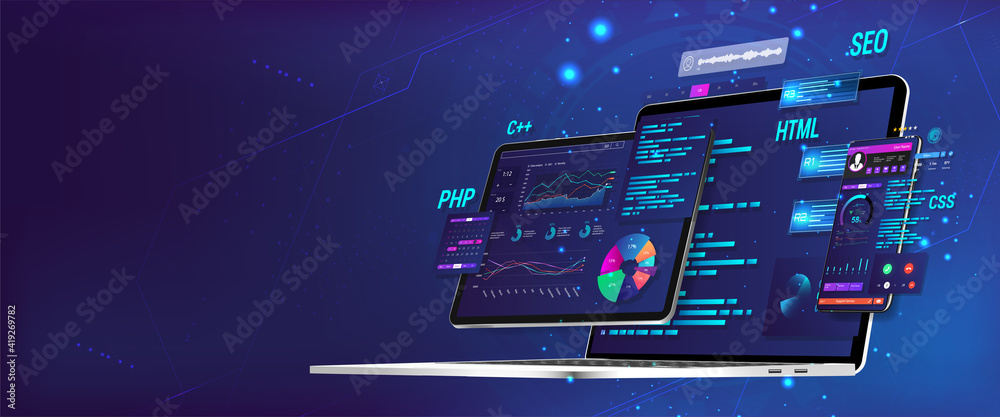

   <h1>
      Project Name
	    
      
      
      
	    
       
   </h1>

> [!IMPORTANT]
> Follow the procedures listed in the file [*INSTALL.md*](INSTALL.md) to install the project execution requirements.

> ✦ **Summary**
> - [About](#about)
> - [Config](#config)
> - [...](#)

---

### About

...

---

### Config
> **Make sure you have the required dependencies installed (listed in the `requirements.txt` file).**

<b>Steps:</b>

1. Copy repository locally:
   - Clone the project's source code repository to your local development environment. This can be done using version control tools such as Git.
2. Adapt variables to the new client:
   - Identify and update all variables and settings in the source code that are specific to the new client. This may include environment settings, API URLs, access keys, etc.
3. Reference new spreadsheets and/or databases:
   - If the system or application is integrated with client-specific spreadsheets or databases, make the necessary changes so that the system can connect and interact with these new data resources.
4. Perform testing:
   - Perform unit, integration, and acceptance testing to ensure that the changes made to adapt the system to the new client have not introduced regressions or unexpected issues. This may include functionality, performance, security, and usability testing.
5. Deploy:
   - After successful completion of testing, proceed with the deployment process of the system or application adapted to the customer environment. This may involve configuring servers, updating production environments, and verifying that all configurations and integrations are working as expected.

